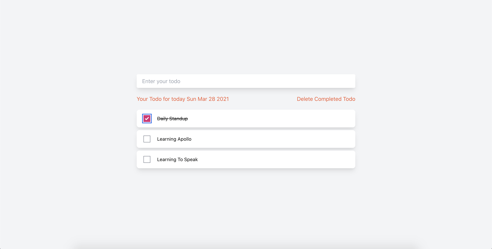

# Personal Todos Server

Hi! It's my project **personal-todos-system** for server with authentication using Apollo Server and Javascript.. If you want to check on my client code, go to my another repo by clicking [here](https://github.com/beebeewijaya-tech/todos-client)



## Installation

Use the package manager [yarn](https://yarnpkg.com/) or [npm](https://nodejs.org/en/) to install this project.

```bash
-> cd project
-> yarn or npm install
```

## How to Run locally

to run this project you must set up on root `index.js` file

```bash
const knexConfig = {
  client: "mysql2",
  connection: {
    host: "127.0.0.1",
    user: "your_db_username",
    password: "your_db_password",
    database: "your_db",
  },
};
```

Change this to your own credentials.

---

After that, you can create table on your own local, by executing this command

```bash
/* User Table */
CREATE TABLE `users` (
  `id` varchar(255) NOT NULL,
  `fullname` varchar(255) DEFAULT NULL,
  `email` varchar(255) DEFAULT NULL,
  `bio` text,
  `password` text,
  PRIMARY KEY (`id`),
  UNIQUE KEY `phoneNumber_UNIQUE` (`email`)
) ENGINE=InnoDB DEFAULT CHARSET=utf8mb4 COLLATE=utf8mb4_0900_ai_ci

CREATE TABLE `todos` (
  `id` varchar(255) NOT NULL,
  `text` varchar(255) DEFAULT NULL,
  `author` varchar(255) DEFAULT NULL,
  `isCompleted` tinyint(1) DEFAULT '0',
  `createdAt` datetime DEFAULT CURRENT_TIMESTAMP,
  PRIMARY KEY (`id`)
) ENGINE=InnoDB DEFAULT CHARSET=utf8mb4 COLLATE=utf8mb4_0900_ai_ci
```